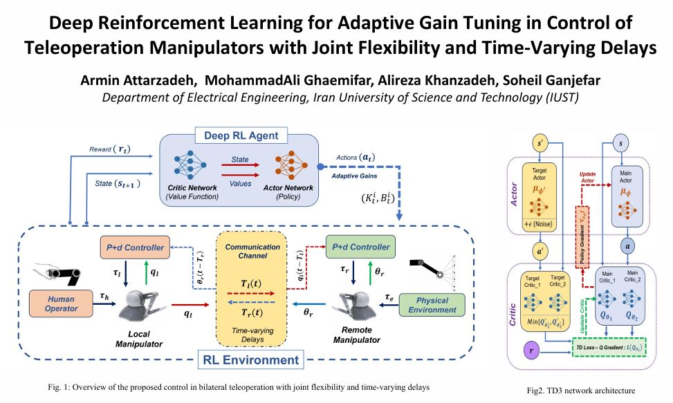

# Deep-RL Adaptive Gain Tuner for Flexible-Joint Teleoperation with Time-Varying Delays  

**Paper:** Deep Reinforcement Learning for Adaptive Gain Tuning in Control of Teleoperation Manipulators with Joint Flexibility and Time-Varying Delays 
[ArXiv](https://arxiv.org/abs/2607.21145)
[PDF](assets/Revised_Paper.pdf) – ICRoM 2025  
**Poster:** [Conference Poster](assets/103_final_poster.pdf)

## 1. Algorithm in a Nutshell
We let a reinforcement-learning agent sit on the slave side of a bilateral teleoperation setup and continuously decide how stiff or how damped the slave should be at every instant. The agent is built on the TD3 (Twin-Delayed Deep Deterministic Policy Gradient) algorithm and needs no model of the robot or of the network. It only watches the motion of the slave motor, the delayed master position, and two error signals that tell it how well the slave is tracking and how much the flexible joint is vibrating. Each decision is a fresh set of proportional and damping gains sent to the local P+d controller. A simple safety rule keeps the chosen gains inside a stability-certified range, so the system remains stable even when the internet delay keeps changing. Training is done once, offline; afterwards the same neural-network weights run in real time inside Simulink with no further tuning.

## 2. Code Layout
Only two files are essential to grasp or reproduce the work:

| File | Purpose |
|------|---------|
| `single_agent_TD3.mlx` | MATLAB live script that creates the TD3 agent: network architectures, hyper-parameters, replay buffer, exploration noise and target-update logic. Execute it once to build and save the agent. |
| `flexible_joint_v4_rl_Slave_Action_2025.slx` | Simulink model that acts as the training/simulation environment. It contains the 2-DOF flexible-joint slave, time-varying communication delays, the reward calculator, and an embedded block that queries the trained agent every 10 ms for new gains and immediately applies them to the slave controller. |

Open the live script, run it, then open the Simulink model and simulate; the agent is already wired in and ready to adapt.

## 3. Contributors
[Armin Attarzadeh](https://www.linkedin.com/in/armin-att/), [Mohammad Ali Ghaemifar](https://github.com/Mohammadali-Ghaemifar) , [Alireza Khanzadeh](https://www.linkedin.com/in/a-khanzadeh), [Soheil Ganjefar](https://scholar.google.com/citations?user=ehPSh7EAAAAJ&hl=en)  
Department of Electrical Engineering, Iran University of Science & Technology (IUST)  
Contact: arminattarzadeh@gmail.com

## 4. Citation
“Deep Reinforcement Learning for Adaptive Gain Tuning in Control of Teleoperation Manipulators with Joint Flexibility and Time-Varying Delays,” ICRoM 2025 (DOI: https://arxiv.org/abs/2607.21145 )
